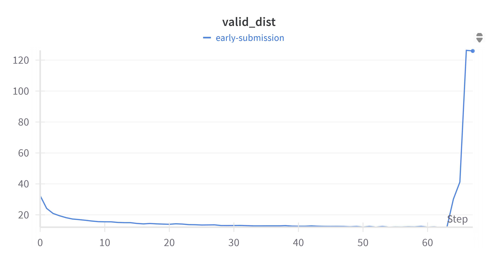

# LibriSpeech_ASR_With_Phonetic_Transcription
 Phoneme/Alphabet transcription from speech using CTC and deep recurrent models.

## Hyperparameters and Tuning:
- Used LockedDropout in LSTM Layer
- Used AdamW optimizer
- Used ReduceLROnPLateau Scheduler
- Used Beam Width 2, the tuned to 5, the to 10
- Used TestBeamWidth of 10 during inference, to improve prediction
- `Checkout Models for more information`

## Metric
- Tracked Validation Levenshtein Distance

